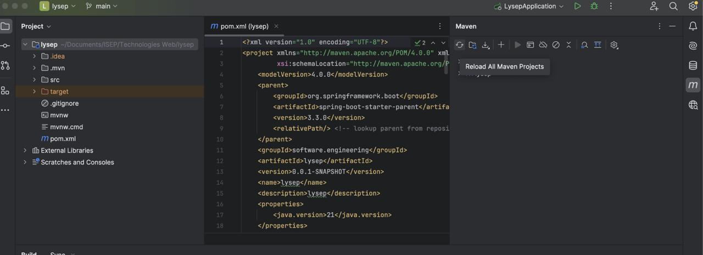

# Backend for Lysep

## Used technologies

Java (Spring Boot, Selenium), Docker, 

## Prerequisites

Install Java (+v18) and Docker Daemon (can be Docker Desktop for instance)

## How to run the backend

- Launch the Docker Daemon
- Open the project and go inside the folder src/main/resources then type docker-compose up smtp4dev
  (Alternatively you can click on the arrow in IntelliJ)
  

- Then on IntelliJ open the file pom.xml and click on Reload All Maven Projects

- Then go the file src/java/software.engineering.lysep/LysepApplication and click on 'Run'
